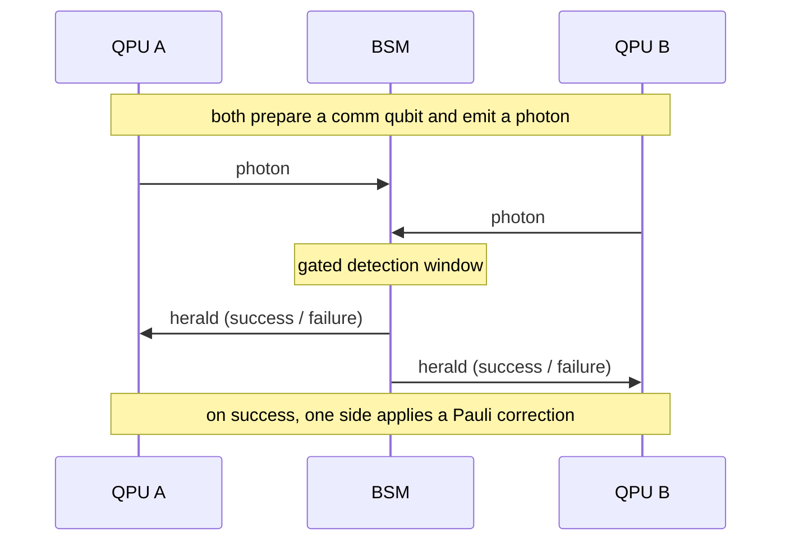
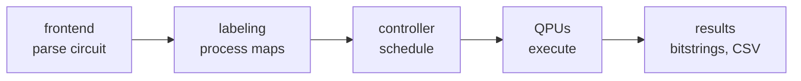
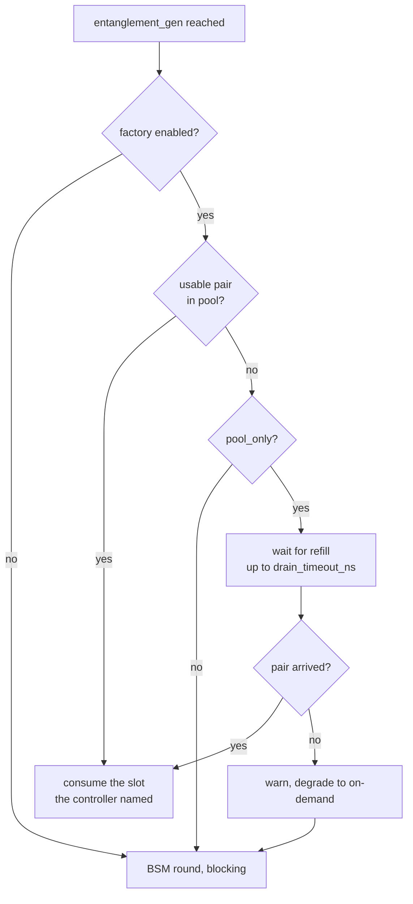
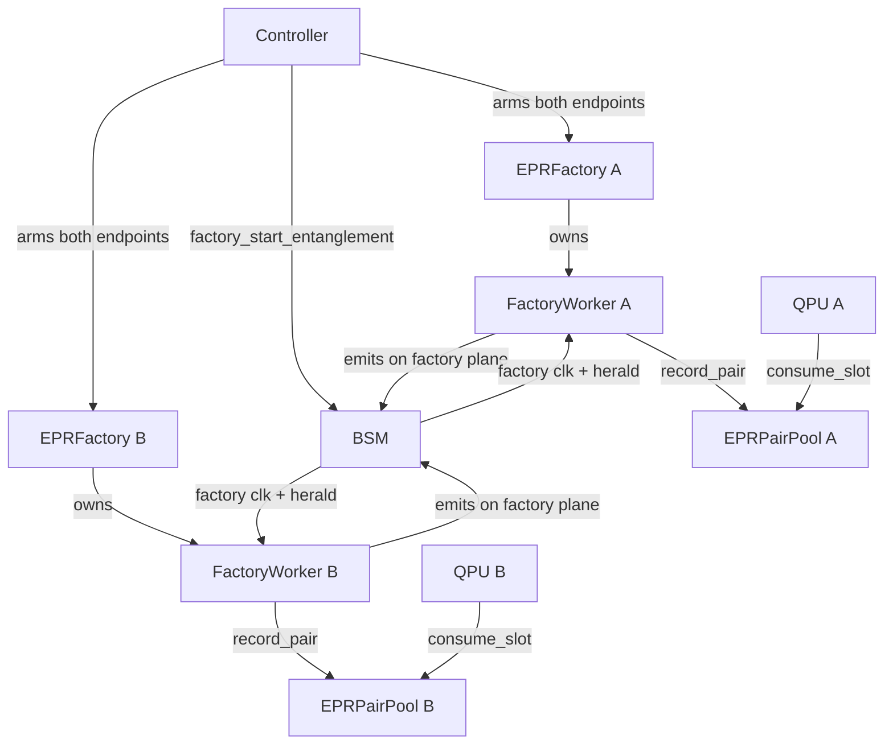

# DQC Simulator Architecture

A NetSquid-based simulator for **distributed quantum computing**: a circuit
too large for one QPU is partitioned across several, and the pieces are
stitched back together with entanglement.

This document covers how the simulator is put together and, in particular,
the three ways it can supply entanglement — which is where most of the
design complexity lives.

---

## 1. The problem

A remote two-qubit gate cannot be executed directly. The standard
construction (eJPP — embedded justified Pauli propagation) instead:

1. establishes a Bell pair between a **communication qubit** on each QPU,
2. uses it to teleport control onto the remote QPU,
3. runs the gate locally,
4. releases the communication qubit.

Every remote gate therefore pays for a Bell pair, and Bell pairs are slow:
generation is probabilistic, so a pair costs a detection window multiplied
by the expected number of retries. On the bundled circuits this dominates
everything else — `grover_9_3qpu` performs 5408 entanglement operations.

The simulator's central concern is **where that latency goes**.

---

## 2. Physical model

### Nodes

| Node | Role |
|---|---|
| **QPU** | Holds qubits and executes gates. Memory is split into a *communication* region (positions 0–19, used for entanglement) and a *data* region (20+, holding circuit state). |
| **BSM** | Bell-state measurement detector. Two QPUs each emit a photon; the BSM interferes them and heralds success or failure. One physical detector, one gated window. |
| **Controller** | Global coordinator. Parses the circuit, assigns work, and runs the barrier that keeps QPUs in lock-step. |
| **Switch** | Optional. With more than one BSM, an optical switch plus a classical switch route QPU↔BSM traffic instead of direct fibre. |

### Topology is authoritative

Qubit counts and connectivity come from the topology JSON, never from
[`parameters.yml`](parameters.yml). Code that allocates qubits must respect
the topology's declared capacity — a QPU declaring 2 communication qubits
must never be handed position 19.

The topology file path and every tunable network or protocol value are
declared in [`parameters.yml`](parameters.yml). This includes BSM detector
settings and clock rate, lengths used when topology data omits a channel
length, simulated channel length, optical switch settings, and EPR factory
maintenance limits. A missing required setting stops the run instead of
selecting a value in Python code. Circuit gate angles and fixed Bell-state
algebra are defined by the circuit and protocol, respectively.

### Entanglement, physically



Failure is normal and the round simply repeats. Because the BSM has **one
detector and one gated window**, two entanglement rounds overlapping on the
same BSM would make the herald unattributable — which is why BSM access is
leased (§4.3).

---

## 3. Code layout

```
sim.py            CLI entry point (dqc-sim)
simulation.py     DQCSimulation — the run loop
config.py         measure-qubit resolution, noise sweeps
results.py        bitstrings, CSV, plots
network/
  topology.py     read topology; create QPU / BSM / controller nodes
  channels.py     wire each plane: control, classical, quantum, BSM, factory
  builder.py      assemble; choose switched vs direct mode
protocols/
  core.py         DQCProtocol — owns every sub-protocol, handles teardown
  controller.py   ControllerProtocol — scheduling, barriers, pool management
  qpu.py          QPUProtocol — gate execution, eJPP, entanglement workers
  bsm.py          BSMProtocol — detection loop, plane selection
  epr_factory.py  EPRFactoryProtocol + FactoryEntanglementWorker
  epr_pool.py     EPRPairPool — bounded store of pre-generated pairs
  fidelity.py     FidelityTracker — T1/T2 decay model
  switch.py       switched-mode entanglement worker
frontends/        circuit input: tket command files, QASM 3 (cisco)
models/           node construction, switches, instruction set, validation
labeling/         assigns process labels used for barrier synchronisation
```

### Protocols

Every protocol is a NetSquid `NodeProtocol` — a generator that yields on
event expressions. They communicate only through ports and signals.

| Protocol | Runs on | Responsibility |
|---|---|---|
| [`DQCProtocol`](protocols/core.py) | — | Owns every sub-protocol; starts them, waits for the active QPUs, tears down |
| [`ControllerProtocol`](protocols/controller.py) | Controller | Parses and labels the circuit, dispatches commands, runs barriers, drives pre-fill and refill, chooses pool slots |
| [`QPUProtocol`](protocols/qpu.py) | QPU | Executes gates, handles eJPP, votes at barriers, consumes pooled pairs, owns per-BSM entanglement workers |
| [`BSMProtocol`](protocols/bsm.py) | BSM | Detection loop; selects circuit or factory plane by message type |
| [`EPRFactoryProtocol`](protocols/epr_factory.py) | QPU | Owns per-peer pools; freshness sweep |
| `FactoryEntanglementWorker` | QPU | Emit-detect-retry on the factory plane. **One per node**, not per BSM — switched mode multiplexes every BSM onto one factory port, so concurrent workers would steal each other's messages |

### Execution flow



The controller parses and labels the circuit, then dispatches commands per
timeslot. QPUs run their command lists, synchronising at each remote
operation through a **barrier**: both parties report ready, and only then
does the controller issue the clock tick that starts the operation.

### Frontends differ in ways that matter

| | tket | cisco (QASM 3) |
|---|---|---|
| source | `commands/*.txt` | `qasm/*.qasm` |
| remote gate | `ejpp_start` / `ejpp_end` op pairs | `entanglement_gen` + `measure` + `if_gate` |
| comm qubit released by | `ejpp_start` (data side), `ejpp_end_link` (link side) | `measure` |

**The second row is a genuine trap.** The cisco frontend emits *no* `ejpp_*`
operations at all. Any logic that assumes comm-qubit release flows through
the eJPP handlers is silently wrong under cisco — see §6.

---

## 4. Entanglement modes

`entanglement.method` selects `magic` or `bsm`. In `magic` mode, a
`PerfectStateMagicDistributor` delivers a perfect Φ⁺ pair directly into the
chosen communication positions on the two QPUs. The controller waits for both
halves to arrive before releasing the barrier. The delivery delay is the
explicit `entanglement.magic_state_delay_ns` value; set it to zero for instant
generation. This bypasses photon loss, the detector, retries, and generation
noise. Memory and gate noise after delivery still follow their own settings.

`bsm` keeps the existing on-demand and factory paths described below. The
BSM EPR factory requires `entanglement.method: bsm`.

### Entanglement timing

For each `entanglement_gen` label, the timer starts when the controller has
received both QPUs' ready messages. In BSM mode it stops after both memory
halves are ready, including detector clock waits, every retry, herald travel,
and required Pauli corrections. In magic mode it stops when the distributor
has installed both halves. With `magic_state_delay_ns: 0`, generation takes
zero simulated time. For pooled BSM pairs, the timer measures the time from
the paired request to both QPUs consuming their pre-generated halves.

Each run's `entl_time_s` is the average over all Bell pairs used by that run.
`mean_entl_time_s` is the equal-weight average of those per-run means across
the configured runs. Both values appear in the result CSV, whose filename
includes the entanglement method so BSM and magic results can coexist.

Within `bsm`, three factory settings selected by [`parameters.yml`](parameters.yml)
share the same detector machinery and differ in *when* pairs are generated.

| Mode | `enabled` | `pool_only` | Pairs generated |
|---|---|---|---|
| **On-demand** | `false` | — | When the circuit asks, blocking |
| **Pooled with fallback** | `true` | `false` | Ahead of time + refilled; falls back on-demand |
| **Pool-only** | `true` | `true` | Ahead of time + refilled; waits instead of falling back |

What happens when a QPU reaches an `entanglement_gen` command:



Consumption still goes **through the barrier**: a pooled pair must be taken
on both sides or neither, so both QPUs vote and the controller only sets
`use_pool` on a unanimous vote. This keeps execution in lock-step and leaves
the on-demand path byte-identical when the factory is off.

### 4.1 On-demand — the baseline

The QPU reaches an `entanglement_gen` command, votes ready, and blocks while
the controller drives a BSM round. Simple and always correct, but every
remote operation pays full entanglement latency on the critical path.

This mode is the **correctness reference**: the other two are validated by
comparing their output distributions against it.

### 4.2 Pooled — the EPR factory

The factory pre-generates Bell pairs into per-pairing pools and refills them
during execution, so a remote operation can consume a pair that already
exists.



Four design elements make this work.

#### A dedicated classical plane

The factory cannot share the circuit's NetSquid ports. If both await
`clk_from_{bsm}` and `bsm_res_from_{bsm}`, NetSquid delivers each message to
whichever waiter the scheduler picks; the two protocols steal each other's
clock ticks and heralds, and the simulation deadlocks. This is structural —
no amount of ordering avoids it.

The factory therefore has parallel, disjoint ports:

| Plane | QPU ports (direct) | BSM ports |
|---|---|---|
| Circuit | `clk_from_{bsm}`, `bsm_res_from_{bsm}` | `clk_to_{side}`, `BSM_res_to_{side}` |
| Factory | `factory_clk_from_{bsm}`, `factory_bsm_res_from_{bsm}` | `factory_clk_to_{side}`, `factory_BSM_res_to_{side}` |

[`BSMProtocol`](protocols/bsm.py) picks the plane from the message type:
`start_entanglement` → circuit, `factory_start_entanglement` → factory. The
detection loop is identical either way. In switched mode the
`ClassicalSwitch` carries mirrored factory ports.

#### Storage disjoint from compiler positions

The compiler names specific comm positions and **recycles** them: position 0
serves peer A early and peer B later. That is harmless during execution — a
qubit holds one pair at a time — but pools are filled *in advance*, so both
pairings would stage a pair on the same qubit and the second would destroy
the first.

So pool storage is allocated independently, from the top of the comm region
downward, disjoint from every position the circuit names. A
`{compiler_position: actual_position}` remap table then redirects each
reference, installed at consumption and dropped at release.

> **Every comm-qubit use site must resolve through this table** — gates,
> corrections, measurement, and release alike. Missing one is not a crash
> but a wrong answer: the operation silently addresses an untouched qubit.

#### Slot identity, chosen by the controller

Consuming a Bell pair is two-sided: if QPU 1 takes the half on its qubit 19,
QPU 2 must take the matching half on its qubit 16, or both are operating on
qubits entangled with something else.

Each pair carries a **`slot_id`** written into both halves at generation.
The **controller names the slot** in the clock tick, choosing from the
intersection of both sides' usable sets, and both endpoints call
`consume_slot`.

An earlier design had each side independently take its lowest usable slot.
That agrees only while the pool is static — under continuous refill the two
endpoints consume at slightly different instants, so a slot committed in
between is visible to one and not the other. It produced wrong answers while
every pre-fill-only test stayed green.

The invariant is checked, not assumed: the first QPU to reach a label
publishes what it took and the second verifies identical `slot_id` and
crossed positions, logging `POOL DESYNC` on mismatch.
[`test_slot_agreement.py`](../../tests/test_slot_agreement.py) additionally
sabotages the rule to prove the detector is not vacuous.

#### Fidelity-aware eviction

Stored pairs decohere. For a |Φ⁺⟩ pair in two independent T1/T2 memories:

```
F(t) = ¼ (1 + e^(−t/T1ᴬ) e^(−t/T1ᴮ) + 2 e^(−t/T2ᴬ) e^(−t/T2ᴮ))
```

[`FidelityTracker`](protocols/fidelity.py) inverts this to a maximum useful
age, and a periodic sweep discards pairs past it. With the default
`T1=T2=1e15` decoherence is negligible; with realistic trapped-ion values
(`T1=600 ms`, `T2=60 ms`) a 30 ms-old pair has already fallen to F≈0.68.

### 4.3 Continuous refill

Pre-fill alone cannot keep up: a pool of a few dozen pairs against thousands
of operations leaves most of the circuit on the on-demand path. Refill
regenerates slots *during* execution.

Three constraints shape it.

**BSM leasing.** One round per BSM at a time, or heralds become
unattributable. Refill and the circuit lease from the same arbiter, so they
can never fire on one BSM simultaneously.

**Non-blocking dispatch.** The controller must keep draining `start_ready`
messages while refill is in flight; if it blocks, the circuit stalls behind
its own entanglement supply.

**Commit protocol.** A refilled pair is invisible until *both* halves land.
A half-landed slot offered to one endpoint is a desync waiting to happen.

Two implementation facts worth knowing:

- **Memory busy-ness is per position, not per processor.**
  `mem_positions[i].busy` is what matters; the processor-wide `qmemory.busy`
  is not. Refilling a comm qubit genuinely proceeds in parallel with data
  qubit gates. Guarding on the processor-wide flag deadlocks.
- **Refill must stop for finished QPUs**, checked per pairing. A round
  dispatched after a QPU is done retries forever and `sim_run()` never
  returns. Halting globally on the first `done` is also wrong: it starves
  pairings whose QPUs are still running.

### 4.4 Pool-only and block-on-drain

With `pool_only: true` there is no on-demand fallback — a QPU whose pool is
empty waits on the factory's `PAIR_GENERATED` signal.

The wait is **bounded** by `drain_timeout_ns`. On timeout the QPU **degrades
to on-demand with a warning** rather than aborting: a transient shortfall
should not discard an otherwise valid run, but it should be visible. Two
exhaustion modes are reported distinctly:

| Warning | Meaning |
|---|---|
| `POOL STARVATION TIMEOUT` | Refill *can* progress; it was simply too slow |
| `POOL TOO SHALLOW` | Every slot is pinned; no refill is possible, waiting cannot help |

Both are real signals — demand exceeded regeneration throughput, so either
the pool is too shallow or the BSMs are saturated.

---

## 5. Configuration

```yaml
epr_factory:
  enabled: false              # false → on-demand only
  pool_size_per_pair: 8       # demand the pool absorbs before waiting on refill
  comm_qubits_reserved: 16    # max comm qubits per QPU for pool storage
  min_fidelity: 0.9           # staleness threshold
  check_interval_ns: 1000000  # freshness sweep period
  pool_only: true             # no on-demand fallback; wait for refill
  drain_timeout_ns: 5000000   # bound on that wait
```

Pool storage competes with the circuit for the same comm qubits, so
`comm_qubits_reserved` is clamped to what the topology actually provides
minus what the circuit uses, and split **evenly across each QPU's peers**.

Even splitting is not cosmetic. Allocating greedily in peer order caused
total coverage to *fall* as `pool_size` rose — the first pairing claimed 16
of 20 qubits, the second got 2, and since pre-fill pairs slots via `min()`
of the two endpoints, the starved pairing collapsed. Coverage went from 67%
at `pool_size=8` to 42% at 16. With even splitting it is monotonic.

If the circuit already uses every comm qubit, that QPU's pools are dropped
with a warning and its entanglement is served on demand.

---

## 6. Invariants worth preserving

Each of these was learned by breaking it.

**Resolve comm positions through the remap table at every use site.**
Gates, corrections, measurement, release. A pooled pair does not live where
the compiler thinks it does. The cisco bug was exactly this: `measure` did
not resolve, so the circuit measured an untouched qubit — a random bit — 78
times in a single run, and never released the real one. Output TVD went to
0.900 against a 0.100 noise floor.

**Update release state on every release path, not just the eJPP ones.**
Same root cause, other half. cisco releases via `measure`; tket via
`ejpp_start` / `ejpp_end_link`. Logic attached only to eJPP is invisible to
cisco.

**Do not rebind a remap entry that is still live.** The data side resolves
`free_comm_qubit` through the table, so rebinding makes the earlier episode
free the *wrong* qubit and leak the right one. It presents as pool
exhaustion, far from the cause.

**`ejpp_end` releases nothing locally.** Its `comm_qubit` names the *remote*
position. Only `ejpp_start` (data side) and `ejpp_end_link` (link side)
release locally.

**An idle QPU must not be awaited.** A circuit need not use every QPU the
topology provides — cisco maps a 2-QPU circuit onto the 3-QPU topology. An
idle QPU never signals SUCCESS. Without the factory this merely blocks
teardown and the event queue still drains; with the factory the maintenance
loop keeps the queue alive and the simulation spins until the OS kills it.
`DQCProtocol` derives its active set from the parsed commands and stops the
rest.

**Verify correctness by distribution, never by top bitstring.** On flat
distributions the baseline's own top bitstring varies run to run, so a
top-bitstring match is not a discriminator. Compare **total variation
distance against two independent baseline runs**, treating the
baseline-vs-baseline TVD as the noise floor. An earlier design passed
top-bitstring checks and zero-desync checks while randomising the output:

| | TVD |
|---|---:|
| baseline vs baseline (noise floor) | 0.075 |
| baseline vs the broken design | **0.725** |
| baseline vs the correct design | 0.075 |

---

## 7. Tests

| Test | Scope |
|---|---|
| [`test_fidelity.py`](../../tests/test_fidelity.py) | T1/T2 decay and threshold maths |
| [`test_epr_pool.py`](../../tests/test_epr_pool.py) | Pool add / consume / evict |
| [`test_refill_scheduler.py`](../../tests/test_refill_scheduler.py) | BSM leasing: one round per BSM, conflicts serialise, disjoint pairings batch |
| [`test_prefill_smoke.py`](../../tests/test_prefill_smoke.py) | Port wiring, pre-fill, consumption — the fast signal |
| [`test_slot_agreement.py`](../../tests/test_slot_agreement.py) | Both sides take counterpart halves; detector is not vacuous |
| [`test_comm_qubit_constraints.py`](../../tests/test_comm_qubit_constraints.py) | Storage bounded by topology capacity |
| [`test_pool_tvd.py`](../../tests/test_pool_tvd.py) | **tket distribution matches baseline by TVD** |
| [`test_cisco_factory.py`](../../tests/test_cisco_factory.py) | **cisco terminates and matches baseline by TVD** |
| [`test_e2e_factory.py`](../../tests/test_e2e_factory.py) | Fuller baseline-vs-factory comparison |

The two TVD tests are the ones that decide whether the factory is correct.
Every end-to-end test is watchdog-guarded, so a re-introduced deadlock fails
loudly instead of hanging.

---

## 8. Known limitations

- **Multi-BSM throughput is unverified end to end.** The leasing rules hold
  at unit level, but the bundled topologies wire exactly one BSM per
  pairing, so added-BSM parallelism cannot be exercised. Confirming it needs
  a topology with a redundant BSM.
- **One live pooled pair per compiler position.** The remap table is keyed
  by compiler position, so a second pair nominating a live key falls back to
  on-demand for that operation. eJPP episodes on a position are sequential,
  so this rarely binds — but it caps concurrent drain depth.
- **Fidelity vs availability under aggressive noise is untested.** A pair
  refilled early may decohere before use, causing repeated refill of a slot
  never consumed in time. Not observed at current depths and timeouts.
- **No latency benchmark.** Evidence establishes correctness and coverage,
  not speedup. Pre-fill moves entanglement cost earlier rather than removing
  it; measured simulated time is essentially unchanged. Quantifying the
  benefit needs a workload whose critical path is dominated by entanglement
  latency that pre-fill can hide.
- **Pairs are never reused** — consuming a Bell pair measures it. Reuse
  happens in the *compiler*: tket aggregates many gates onto one distributed
  pair, averaging 20 per pair on `grover_7_3qpu`. The QAOA circuits sit at
  exactly 2.00, which is where compiler-side gains remain.
- **Environment.** NetSquid's compiled extensions require `numpy<2`, which
  conflicts with recent qiskit releases requiring `numpy>=2`.
